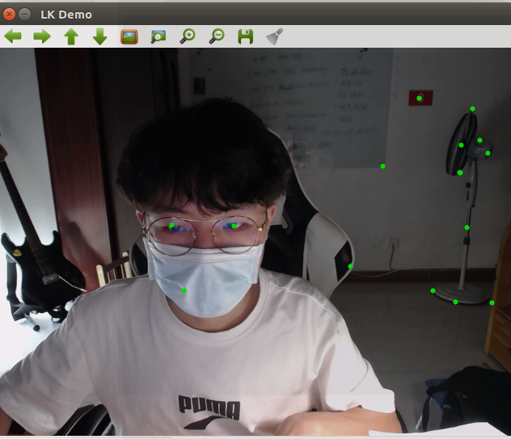
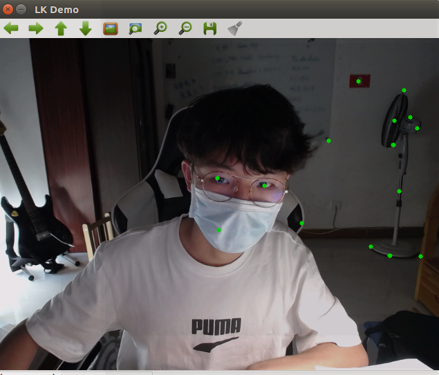

# LK-flow demo

```
Yunfan REN
renyunfan@outlook.com
```

# Build

```bash
mkdir build
cd build
cmake ..
make
```

# Run the demo

```bash
cd LK_Flow
./demo
```

# Result






As you can see, the key point is following me while moving.

# Issue

If you find you cannot open your camera, try

```bash
ls /dev/video*
```

if your video camera ID is not `video0`, you should open `src/demo.cpp` and add a line

```cpp
cap.open(${the index of your camera})l;
```

at the line 63.


