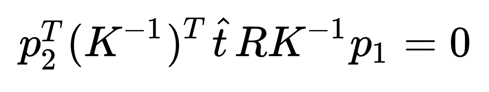
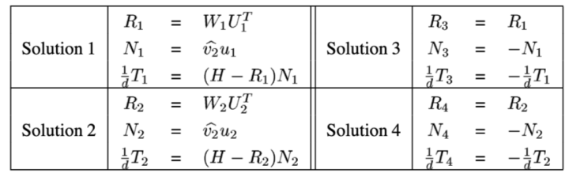

# CS294 HW2-Prog
> Name: Yunfan REN
> SID: 3035535419
>
> E-mail: renyunfan@berkeley.edu

# Description

This project is based on CS294 of Berkeley 2020 spring.

# Result

```bash
Using the image 2
------------------------ 8 Point ----------------------------
The rotation is:
 [[ 6.94105429e-04  9.96131455e-01 -8.78728811e-02]
 [ 9.99569714e-01 -3.26792122e-03 -2.91497482e-02]
 [-2.93241427e-02 -8.78148376e-02 -9.95705101e-01]]
The translation is:
 [-8.72103096e-02 -4.85287941e-04 -9.96189804e-01]
------------------------ 4 Point ----------------------------
Rotation matrix R :
 [[ 8.63234935e-01 -7.07965599e-02  3.36349274e-03]
 [-9.24358589e-02  1.08383554e-01 -1.03185577e-02]
 [-3.20926409e-05  8.67529273e-03  8.70102926e-02]]
Translation vector T:
 [[-1.17661594]
 [-9.88376738]
 [-0.08577937]]

Process finished with exit code 0
```


# Theory

## 8 Points

The matrix K 


From epipolar constrain



So we first find the fundamental matrix by solving


Then we calculate the essential matrix by:


Then we do SVD and find the transformation:


Finally we select one solution from all 4 solutions:


We assume s1 > 0 to calculate P, then use the equation 2 to calculate s2. If s2 > 0 the solution is resonable.

## 4 Points



