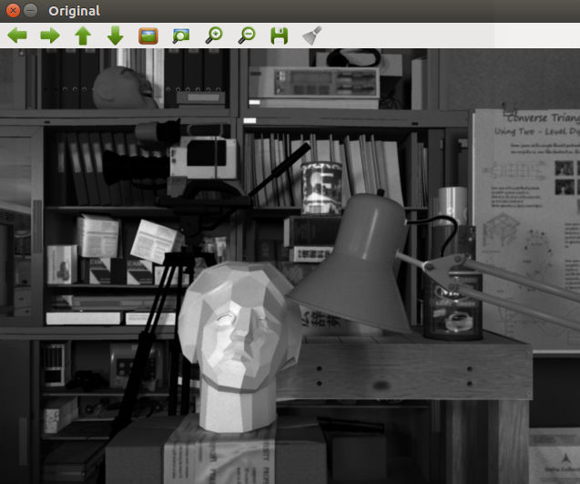
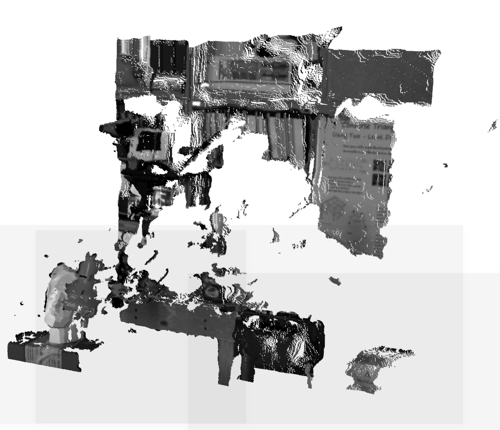

# bi2pc

> Yunfan REN
>
> renyunfan@outlook.com

`bi2pc` is a ros package designed by Yunfan REN. You can use it to convert binocular image to point cloud and depth image. The sturcture of this package is shown as follow:

```bash
bi2pc
├── app
│   └── node.cpp			(This is an example)
├── CMakeLists.txt
├── cmake_modules			(Include cmake files)
│   ├── FindCSparse.cmake
│   ├── FindG2O.cmake
│   └── FindGlog.cmake
├── config					(Include config file)
│   └── default.yaml
├── data					(Include test data)
│   ├── left.png
│   └── right.png
├── include					(Library)
│   └── bino				
│       ├── bino_toolbox.h	(Toolbox in the name space kbino)
│       ├── common_inc.h
│       └── config.h
├── package.xml
└── src						(Source files)
    ├── bino_toolbox.cpp
    └── config.cpp

```

# How to install

Copy this package to `catkin_ws/src`

```bash
cd catkin_ws
catkin_make
source devel/setup.bash
```

# Test

## Original



## Depth 


## Show in Pangolin



# How to use

Fist of all, you should set you camera intrinsics and extrinsic in the  `config/default.yaml`,  and you should also set the topic name of left and right eyes.

```yaml
%YAML:1.0

# camera intrinsic and extrinsics
camera.fx: 458.654
camera.fy: 457.296
camera.cx: 367.215
camera.cy: 248.375
camera.d: 1	# Base line length of stereo

# image resize ratio
#	A smaller number may speed up this algorithm,
#	but make it less accurate.
image.zoom: 0.8

# Topic to read
topic_name.left: /camera/left/image_raw
topic_name.right: /camera/right/image_raw
```

Then you can write you own node follow the example `app/node.cpp`

```cpp
// 1 stet you config file path
std::string config_file = "/home/kevin/Documents/Github/kVisons/bi2pcl/config/default.yaml";

// 2 Star ros and read the config file
ros::init(argc, argv, "bi2pc");
kbino::Bi2PC b2p(config_file);
kbino::BiRosInterface node;


// 3 read the file and do process
while(!ros::isShuttingDown()){
        // Start clock
        start = clock();

        cv::Mat left = node.getLeft();
        cv::Mat right = node.getRight();
        if(left.empty()||right.empty()){
            ros::spinOnce();
        }

        else{
            b2p.bi2pc(left,right);
            // if you want to publish point cloud
//            node.PcPublish(b2p.getPointCloud());
            node.imagePublish(b2p.getDis());

            en= clock();   //结束时间
            cout<<"Freq = "<<CLOCKS_PER_SEC/(double)(en-start)<<"Hz"<<endl;
        }
        ros::spinOnce();
    }
```


